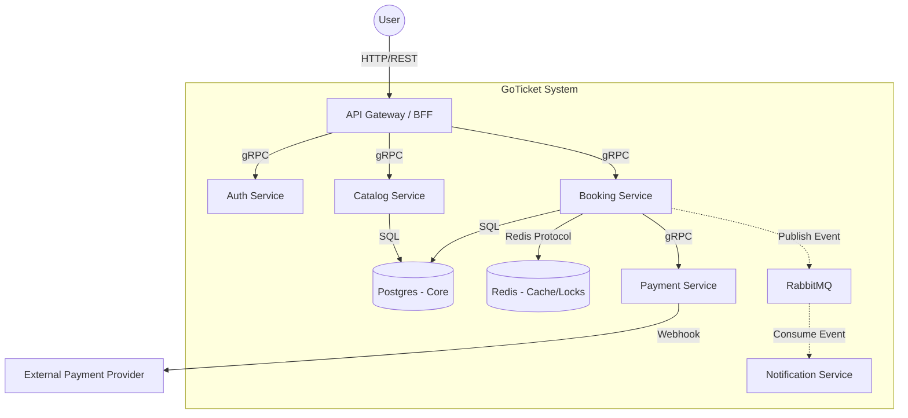
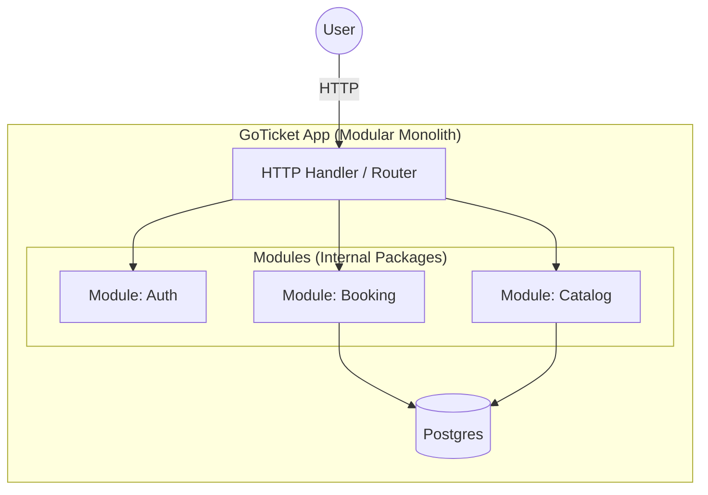

# C4 Architecture - GoTicket

Ten dokument wizualizuje architekturę systemu na poziomie kontenerów (serwisów).

## Level 1: System Context
Użytkownik kupuje bilet. System komunikuje się z Płatnościami i Emailami.

## Level 2: Container Diagram (Target State: Microservices)

## Level 2: Container Diagram (Initial State: Modular Monolith)
Na początku (Phase 1-2) wszystko będzie w jednym binarnym pliku, ale z zachowaniem separacji pakietów (modułów).

