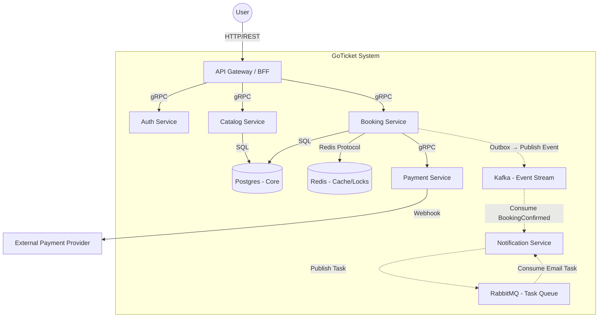
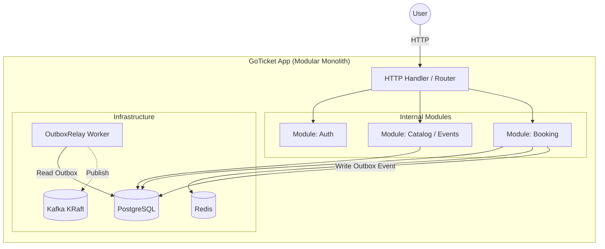

# C4 Architecture — GoTicket

This document visualizes the system architecture at the container (services) level using the C4 model.

---

## Level 1: System Context

The user purchases a ticket. The GoTicket system handles reservations, communicates with an external Payment Provider, and sends notifications via email.

---

## Level 2: Container Diagram — Target State (Microservices)

The target architecture after the modular monolith is split:


```mermaid
graph TD
    User((User))
    PaymentGW[External Payment Provider]

    subgraph "GoTicket System"
        Gateway[API Gateway / BFF]
        Auth[Auth Service]
        Catalog[Catalog Service]
        Booking[Booking Service]
        Payment[Payment Service]
        Notification[Notification Service]

        DB_Core[(Postgres - Core)]
        Redis[(Redis - Cache/Locks)]
        Kafka[Kafka - Event Stream]
        RabbitMQ[RabbitMQ - Task Queue]
    end

    User -->|HTTP/REST| Gateway
    Gateway -->|gRPC| Auth
    Gateway -->|gRPC| Catalog
    Gateway -->|gRPC| Booking

    Booking -->|SQL| DB_Core
    Booking -->|Redis Protocol| Redis
    Catalog -->|SQL| DB_Core

    Booking -->|gRPC| Payment
    Payment -->|Webhook| PaymentGW

    Booking -.->|Outbox → Publish Event| Kafka
    Kafka -.->|Consume BookingConfirmed| Notification
    Notification -.->|Publish Task| RabbitMQ
    RabbitMQ -.->|Consume Email Task| Notification
```

---

## Level 2: Container Diagram — Initial State (Modular Monolith)

Phases 1–4: everything runs in a single binary, but with strict package separation:


```mermaid
graph TD
    User((User))

    subgraph "GoTicket App (Modular Monolith)"
        HTTP[HTTP Handler / Router]

        subgraph "Internal Modules"
            Mod_Auth[Module: Auth]
            Mod_Catalog[Module: Catalog / Events]
            Mod_Booking[Module: Booking]
        end

        subgraph "Infrastructure"
            DB[(PostgreSQL)]
            Redis[(Redis)]
            Kafka[(Kafka KRaft)]
            OutboxRelay[OutboxRelay Worker]
        end
    end

    User -->|HTTP| HTTP
    HTTP --> Mod_Auth
    HTTP --> Mod_Catalog
    HTTP --> Mod_Booking

    Mod_Booking --> DB
    Mod_Booking --> Redis
    Mod_Booking -->|Write Outbox Event| DB
    OutboxRelay -->|Read Outbox| DB
    OutboxRelay -.->|Publish| Kafka
    Mod_Catalog --> DB
```

---

## Level 3: Component Diagram — Booking Module

```
BookingHandler (HTTP)
    ↓ calls
BookingService (Domain Logic)
    ↓ uses
TransactionManager (PostgreSQL TX)
    ├─ BookingRepository (SQL via sqlc)
    └─ OutboxRepository (SQL via sqlc)
    ↓ async
OutboxRelay (Goroutine Worker)
    └─ MessageBroker interface
        └─ KafkaBroker (IBM/sarama SyncProducer)
```

---

## Architecture Decision: Why Modular Monolith First?

- **Simpler development**: One deployment unit, one codebase, straightforward debugging
- **Learn the domain first**: Premature microservices decomposition is a well-known anti-pattern
- **Evolutionary Architecture**: Split along proven bounded context lines, not guesses

**Reference**: Martin Fowler — "MonolithFirst" pattern.

**Question to think about**: At what point does a modular monolith become a liability? What signals tell you it's time to extract a service?
